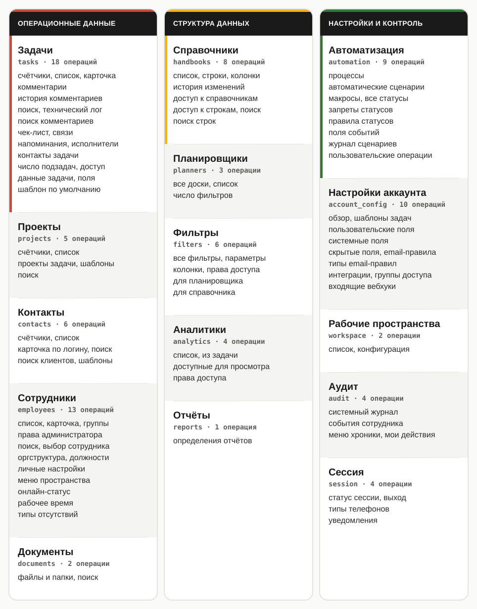

**ru** · [en](README.en.md)

# planfix-mcp

Неофициальный MCP-сервер для Планфикс.  
В текущей версии представлены **93 операции чтения, которые условно можно поделить на 15 доменных разделов**.



Примеры запросов:

- «Разбери инцидент по задаче №123: сопоставь карточку, комментарии и технический лог, построй хронологию изменений статуса, исполнителей и сроков.».
- «Подготовь отчёт по просроченным задачам: сгруппируй их по ответственным и проектам, выдели самые критичные случаи и отличай плановый срок от фактической даты завершения».
- «Проведи аудит изменений конфигурации за неделю: кто, когда и что менял, какие изменения повторялись и какие процессы могли быть затронуты».
- «Собери риск-отчёт по клиенту: найди связанные проекты и открытые задачи, просрочки, зависимости и последние значимые события. Назови ответственных и пять главных рисков».
- «Проведи инвентаризацию интеграций и входящих вебхуков: выдели отключённые и подозрительно дублирующиеся элементы, а также явно укажи, какие детали нельзя проверить через доступные данные».


## Замечания

- Описанные команды сочтены немутирующими, но важно понимать, что потенциально они могут иметь побочные эффекты на стороне Planfix — например, обновить отметку просмотра/прочтения или активность сессии. Код открыт — перед использованием изучите его и самостоятельно оцените возможные риски, ответственность за использование лежит на пользователе.
- Это неофициальный проект, не связанный с Planfix. Он использует интерфейс, используемый веб-клиентом, поэтому функциональность напрямую зависит от версии PF.
- Частота по умолчанию ограничена одним запросом в секунду, настраивается через переменные окружения.
- Chromium используется только на время входа. Сессионные данные хранятся только в памяти процесса.
- Вход автоматический, происходит на первом запросе, поэтому он может выполняться довольно долго.


## Как устроен сервер

MCP-клиент запускает Python-процесс и взаимодействует с ним через stdio. Сервер:

1. входит в Planfix через Playwright Chromium;
2. получает данные сессии, затем закрывает браузер;
3. запрашивает данные путем вызова HTTP-запросов;
4. возвращает очищенный и сокращённый ответ.


## Установка

Требуются Python **3.14** и Chromium. В каталоге проекта выполните:

```bash
python3.14 -m venv .venv
.venv/bin/python -m pip install .
.venv/bin/python -m playwright install chromium
cp .env.example .env
chmod 600 .env
```

Windows (PowerShell):

```powershell
py -3.14 -m venv .venv
.\.venv\Scripts\python -m pip install .
.\.venv\Scripts\python -m playwright install chromium
copy .env.example .env
```

Путь к Chromium, установленному Playwright, определяется автоматически. Для другого браузера укажите в `PF_BROWSER_BIN` абсолютный путь к его исполняемому файлу.

### Настройка аккаунта

Откройте `.env` и укажите:

```dotenv
PF_DOMAIN=company.planfix.com
PF_USERNAME=user@example.com
PF_PASSWORD=secret
```

В `PF_DOMAIN` нужен только хост, без `https://`. `PF_LANG` задаёт язык ответов Planfix и по
умолчанию равен `Ru`.

### Подключение к Cursor или Claude Desktop

Для установки через `.venv` укажите абсолютные пути:

```json
{
  "mcpServers": {
    "planfix": {
      "command": "/abs/path/to/planfix-mcp/.venv/bin/python",
      "args": ["/abs/path/to/planfix-mcp/run.py"]
    }
  }
}
```

На Windows замените пути в конфигурации:

```json
{
  "command": "C:\\Users\\you\\planfix-mcp\\.venv\\Scripts\\python.exe",
  "args": ["C:\\Users\\you\\planfix-mcp\\run.py"]
}
```

Для установки через `uv`:

```json
{
  "mcpServers": {
    "planfix": {
      "command": "uv",
      "args": [
        "run",
        "--directory",
        "/abs/path/to/planfix-mcp",
        "python",
        "run.py"
      ]
    }
  }
}
```

После добавления конфигурации перезапустите MCP-сервер. Не запускайте `run.py` параллельно в терминале.